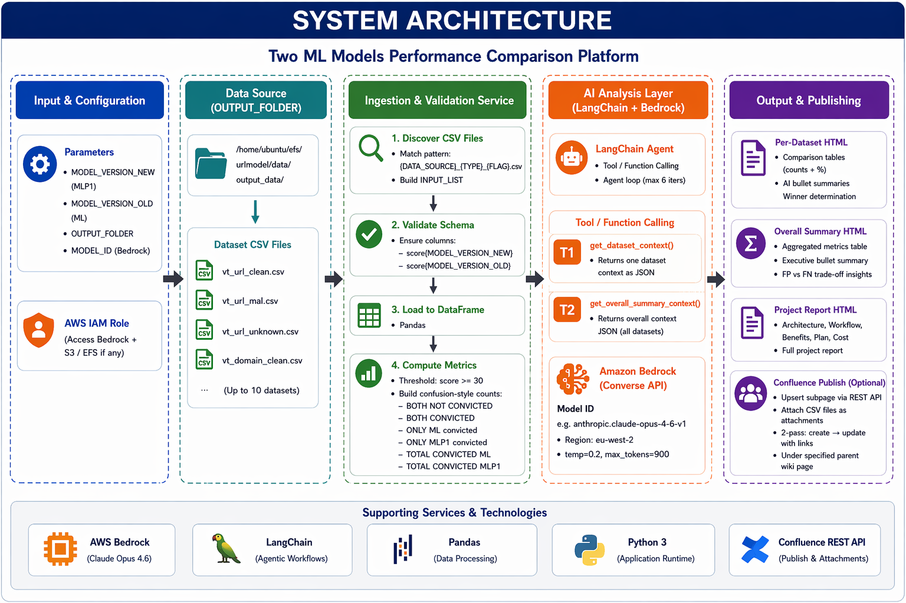

# 🤖 AI Dual-Agent ML Model Comparison Pipeline


> **An agentic AI pipeline that compares two ML URL/domain scoring models across multiple datasets using a dual-agent (Analyst + Reviewer) architecture with autonomous tool selection, conversational memory, and automated Confluence reporting.**

---

## 📋 Table of Contents

- [Overview](#-overview)
- [Architecture](#-architecture)
- [Key Features](#-key-features)
- [Agentic AI Design](#-agentic-ai-design)
  - [Dual-Agent System](#1--dual-agent-system-analyst--reviewer)
  - [Automatic Tool Selection](#2--automatic-tool-selection-function-calling)
  - [Conversational Memory](#3--conversational-memory)
- [Tech Stack](#-tech-stack)
- [Project Structure](#-project-structure)
- [Installation](#-installation)
- [Configuration](#-configuration)
- [Usage](#-usage)
- [How It Works](#-how-it-works)
- [Sample Output](#-sample-output)
- [Skills & Techniques Demonstrated](#-skills--techniques-demonstrated)
- [Cost Estimation](#-cost-estimation)
- [Roadmap](#-roadmap)
- [Contributing](#-contributing)
- [License](#-license)
- [Author](#-author)

---

## 🎯 Overview

This project automates the **end-to-end comparison of two ML URL/domain classification models** (referred to as **MLP1** and **ML**) across multiple labeled datasets. Instead of manually reviewing spreadsheets and writing reports, this pipeline:

1. **Auto-discovers** all valid dataset CSVs in a folder
2. **Computes** statistical comparison tables (conviction counts + percentages)
3. **Deploys an AI Analyst Agent** to generate insight summaries with numeric evidence
4. **Deploys an AI Reviewer Agent** to quality-check the analysis (factual accuracy + clarity)
5. **Aggregates** results into an overall executive summary
6. **Generates** a Confluence-compatible HTML report
7. **Publishes** to Confluence with dataset attachments (optional)

**The core innovation**: a **dual-agent quality assurance loop** where one AI generates analysis and another AI validates it — mimicking a real analyst + peer reviewer workflow.

---

## 🏗 Architecture

```
┌─────────────────────────────────────────────────────────────┐
│                    OUTPUT_FOLDER (CSVs)                      │
│  tranco_url_clean.csv  phishtank_domain_mal.csv  ...        │
└──────────────────────────┬──────────────────────────────────┘
                           │
                  ┌────────▼────────┐
                  │  discover_       │  Regex-based file discovery
                  │  datasets()      │  Validate score columns
                  └────────┬────────┘
                           │
              ┌────────────▼────────────┐
              │   compute_table()       │  Pure statistics:
              │   decide_winner()       │  counts, %, FP/FN winner
              └────────────┬────────────┘
                           │
         ┌─────────────────┼─────────────────┐
         │                 │                 │
         ▼                 ▼                 ▼
  ┌──────────────┐  ┌──────────────┐  ┌──────────────┐
  │  DATASET_    │  │  REVIEW_     │  │  OVERALL_    │
  │  REGISTRY    │  │  REGISTRY    │  │  REGISTRY    │
  │  (per-file)  │  │  (per-file)  │  │  (aggregate) │
  └──────┬───────┘  └──────┬───────┘  └──────┬───────┘
         │                 │                 │
         ▼                 ▼                 ▼
  ┌──────────────┐  ┌──────────────┐  ┌──────────────┐
  │  📊 ANALYST  │  │  🔍 REVIEWER │  │  📈 OVERALL  │
  │    AGENT     │  │    AGENT     │  │    AGENT     │
  │              │  │              │  │              │
  │ Tool:        │  │ Tools:       │  │ Tool:        │
  │ get_dataset_ │  │ get_review_  │  │ get_overall_ │
  │ context()    │  │ context()    │  │ summary_     │
  │              │  │ get_dataset_ │  │ context()    │
  │              │  │ context()    │  │              │
  └──────┬───────┘  └──────┬───────┘  └──────┬───────┘
         │                 │                 │
         └─────────────────┼─────────────────┘
                           │
                  ┌────────▼────────┐
                  │  build_         │  Confluence-compatible
                  │  confluence_    │  HTML generation
                  │  html()         │
                  └────────┬────────┘
                           │
              ┌────────────┼────────────┐
              │                         │
              ▼                         ▼
     ┌────────────────┐       ┌─────────────────┐
     │  📄 Local HTML  │       │  🌐 Confluence   │
     │  Report File    │       │  Page + CSVs     │
     └────────────────┘       └─────────────────┘
```

### System Architecture



### Data Workflow


---

## ✨ Key Features

| Feature | Description |
|---------|-------------|
| 🤖 **Dual-Agent QA** | Analyst generates insights → Reviewer validates accuracy |
| 🔧 **Auto Tool Selection** | LLM autonomously decides which data-fetching tools to call |
| 🧠 **Conversational Memory** | Agent maintains message history across multi-turn reasoning |
| 📊 **Auto Dataset Discovery** | Regex-based CSV detection with column validation |
| 📈 **Statistical Comparison** | Conviction counts, percentages, FP/FN winner logic |
| 🔍 **Anomaly Detection** | Flags data quality issues before AI analysis |
| 🧹 **LLM Output Sanitization** | Multi-layer cleaning: markdown → bullets → HTML |
| 📝 **Confluence Publishing** | Idempotent upsert with attachment linking |
| ⚙️ **Configurable** | `pyproject.toml` + environment variables |
| 🔐 **Security** | HTML escaping, auth flexibility (Basic / Bearer) |

---

## 🧠 Agentic AI Design

This project implements three key agentic AI patterns that go beyond simple LLM prompting:

### 1. 👥 Dual-Agent System (Analyst + Reviewer)

The pipeline employs a **separation-of-concerns** approach inspired by real ML engineering teams:

```
┌───────────────────────────────────────────────────┐
│                 Per-Dataset Loop                   │
│                                                   │
│  ┌─────────────┐         ┌──────────────┐        │
│  │  📊 ANALYST │         │  🔍 REVIEWER │        │
│  │    AGENT    │────────▶│    AGENT     │        │
│  │             │ output  │              │        │
│  │ "Generate   │ feeds   │ "Validate    │        │
│  │  insights"  │ into    │  accuracy"   │        │
│  └─────────────┘         └──────────────┘        │
│        │                        │                │
│   4 bullet points        JSON verdict:           │
│   with evidence          quality_score: 1-10     │
│                          approved: bool          │
│                          feedback: "..."         │
└───────────────────────────────────────────────────┘
```

**Analyst Agent** — Optimizes for *insight quality*:
- Calls `get_dataset_context` to retrieve metrics
- Returns ≤4 concise bullet points with numeric evidence
- Determines winner conclusion (FP/FN tradeoff)

**Reviewer Agent** — Optimizes for *factual accuracy*:
- Calls **both** `get_review_context` and `get_dataset_context`
- Reviews: Are numbers consistent? Is the conclusion supported?
- Returns structured JSON: `quality_score`, `approved`, `feedback`

**Why this matters**: The Reviewer catches hallucinated numbers, unsupported conclusions, and logical errors — acting as an automated peer review gate.

### 2. 🔧 Automatic Tool Selection (Function Calling)

Agents don't receive raw data in their prompts. Instead, they **autonomously decide** which tools to invoke:

```python
@tool
def get_dataset_context(dataset_key: str) -> str:
    """Return JSON context for one dataset key."""

@tool
def get_overall_summary_context(_: str = "overall") -> str:
    """Return JSON context for overall metrics across datasets."""

@tool
def get_review_context(dataset_key: str) -> str:
    """Return JSON review context for one dataset key."""
```

The LLM receives tool schemas via `llm.bind_tools(tools)`, then:
1. **Reasons** about which tool(s) are needed
2. **Generates** tool call(s) with appropriate arguments
3. **Receives** tool results as `ToolMessage`
4. **Synthesizes** a final response

This is the **ReAct (Reason + Act)** pattern — the foundation of modern AI agents.

### 3. 🧠 Conversational Memory

```python
def run_tool_calling_agent(llm, system_prompt, user_prompt, tools) -> str:
    messages = [SystemMessage(...), HumanMessage(...)]

    for _ in range(6):  # Max reasoning iterations
        ai_msg = bound.invoke(messages)
        messages.append(ai_msg)          # Memory grows

        if not tool_calls:
            return ai_msg.content        # Final answer

        for tc in tool_calls:
            payload = execute_tool(tc)
            messages.append(ToolMessage(  # Tool results added
                content=payload, tool_call_id=tc["id"]
            ))
```

The agent maintains a **growing message history** within each session:
- Remembers which tools it already called
- Accumulates context from multiple tool results
- Can chain tool calls across iterations (up to 6 rounds)

---

## 🛠 Tech Stack

| Component | Technology |
|-----------|-----------|
| **Language** | Python 3.11+ |
| **LLM Provider** | AWS Bedrock (Anthropic Claude Opus 4) |
| **Agent Framework** | LangChain (`langchain_aws`, `langchain_core`) |
| **Data Processing** | Pandas |
| **Configuration** | `tomllib` + environment variables |
| **Publishing** | Confluence REST API v1 |
| **HTTP Client** | Requests |

---

## 📁 Project Structure

```
urlmodel/
├── ai_2models10datasets_review.py   # Main pipeline script
├── callmodel.py                     # AWS Bedrock client factory
├── pyproject.toml                   # Project config + Confluence credentials
├── data/
│   └── output_data/                 # OUTPUT_FOLDER
│       ├── tranco_url_clean.csv
│       ├── phishtank_domain_mal.csv
│       ├── openphish_url_mal.csv
│       ├── internal_url_unknown.csv
│       └── ...                      # Auto-discovered CSVs
└── README.md
```

### Dataset File Naming Convention

Files must match: `{DATA_SOURCE}_{TYPE}_{FLAG}.csv`

| Component | Values | Example |
|-----------|--------|---------|
| `DATA_SOURCE` | Any string | `tranco`, `phishtank`, `openphish` |
| `TYPE` | `url` or `domain` | `url` |
| `FLAG` | `clean`, `mal`, or `unknown` | `clean` |

Example: `tranco_url_clean.csv`, `phishtank_domain_mal.csv`

### Required CSV Columns

Each CSV must contain:
- `score{MODEL_VERSION_NEW}` — e.g., `score123456` (MLP1 model scores)
- `score{MODEL_VERSION_OLD}` — e.g., `score654321` (ML model scores)

---

## 🚀 Installation

### Prerequisites

- Python 3.11+
- AWS credentials configured (for Bedrock access)
- Confluence API token (optional, for publishing)

### Setup

```bash
# Clone the repository
git clone https://github.com/your-org/ai-model-comparison-pipeline.git
cd ai-model-comparison-pipeline

# Create virtual environment
python -m venv .venv
source .venv/bin/activate

# Install dependencies
pip install pandas langchain-aws langchain-core requests
```

---

## ⚙ Configuration

### Environment Variables

```bash
export AWS_REGION=us-east-1
export AWS_PROFILE=your-profile          # Or use IAM role

# Optional: Confluence publishing
export CONFLUENCE_EMAIL=your-email@company.com
export CONFLUENCE_TOKEN=your-api-token
```

### pyproject.toml

```toml
[tool.urlmodel]
confluence_email = "your-email@company.com"
confluence_token = "your-api-token"
```

### Pipeline Parameters (in `main()`)

```python
MODEL_VERSION_NEW = "123456"    # MLP1 - placeholder
MODEL_VERSION_OLD = "654321"    # ML   - placeholder
OUTPUT_FOLDER = "/path/to/csvs/"  # Folder containing dataset CSVs
MODEL_ID = "anthropic.claude-opus-4-6-v1"  # Bedrock model ID
```

---

## 💻 Usage

### Basic Run (Local Report Only)

```bash
python ai_2models10datasets_review.py
```

This will:
1. Discover all valid CSVs in `OUTPUT_FOLDER`
2. Run statistical analysis + AI agents
3. Save HTML report locally

### With Confluence Publishing

```python
# In main():
main(CONFLUENCE_PUBLISH=True)
```

### Expected Output

```
INPUT_LIST (10 datasets): ['tranco_url_clean.csv', 'phishtank_domain_mal.csv', ...]
Confluence subpage published/updated: page_id=1234567890
Done.
{
  "datasets_processed": 10,
  "page_title": "URL Model review-FP FN 123456 VS 654321",
  "published_to_confluence": true,
  "review_results": {
    "tranco_url_clean.csv": {
      "quality_score": 9,
      "approved": true,
      "feedback": "Numbers are consistent. Winner conclusion is clear."
    }
  }
}
```

---

## ⚡ How It Works

### Step-by-Step Pipeline

```
Step 1: DISCOVER
        │  Scan OUTPUT_FOLDER for *.csv files
        │  Match regex: {source}_{url|domain}_{clean|mal|unknown}.csv
        │  Validate: both score columns exist
        ▼
Step 2: COMPUTE
        │  For each dataset:
        │  → Count: BOTH CONVICTED, ONLY ML, ONLY MLP1, BOTH NOT CONVICTED
        │  → Calculate percentages
        │  → Determine winner (flag-aware FP/FN logic)
        ▼
Step 3: ANALYZE (Analyst Agent)
        │  For each dataset:
        │  → Agent calls get_dataset_context tool
        │  → Generates ≤4 bullet points with numeric evidence
        │  → Normalizes output (strip markdown, clean bullets)
        ▼
Step 4: REVIEW (Reviewer Agent)
        │  For each dataset:
        │  → Agent calls get_review_context + get_dataset_context
        │  → Evaluates factual accuracy + clarity
        │  → Returns: quality_score (1-10), approved (bool), feedback
        ▼
Step 5: AGGREGATE
        │  Build overall counts across all datasets
        │  Overall Agent generates executive summary
        ▼
Step 6: REPORT
        │  Generate Confluence-compatible HTML
        │  Save locally as .html file
        ▼
Step 7: PUBLISH (Optional)
        │  Upsert Confluence subpage (create or update)
        │  Upload dataset CSVs as attachments
        │  Re-render HTML with attachment links
        ▼
        ✅ Done
```

### Winner Decision Logic

```python
def decide_winner(flag, counts):
    if flag == "clean":
        # Clean datasets: fewer convictions = fewer False Positives = better
        return "MLP1 wins" if mlp1 < ml else "ML wins"
    if flag == "mal":
        # Malicious datasets: more convictions = fewer False Negatives = better
        return "MLP1 wins" if mlp1 > ml else "ML wins"
```

---

## 📸 Sample Output

### Overall Summary Table

| Dataset | Rows | ML Convicted | MLP1 Convicted | Winner |
|---------|------|-------------|----------------|--------|
| tranco_url_clean | 10,000 | 12 (0.12%) | 8 (0.08%) | MLP1 wins (fewer FPs) |
| phishtank_domain_mal | 5,000 | 4,850 (97.00%) | 4,920 (98.40%) | MLP1 wins (fewer FNs) |
| openphish_url_mal | 3,000 | 2,910 (97.00%) | 2,955 (98.50%) | MLP1 wins (fewer FNs) |
| internal_url_unknown | 8,000 | 320 (4.00%) | 295 (3.69%) | Review manually |

### Per-Dataset AI Analysis (Example)

> **phishtank – domain - mal**
>
> **MLP1 wins (fewer FNs).**
>
> - MLP1 convicted 4,920 of 5,000 samples (98.40%) vs ML's 4,850 (97.00%)
> - 70 additional detections by MLP1 represent a 1.44% improvement in catch rate
> - Only 30 samples convicted exclusively by ML, indicating minimal regression
> - MLP1 demonstrates stronger detection capability on this malicious dataset

### Reviewer Verdict (Example)

```json
{
  "quality_score": 9,
  "approved": true,
  "feedback": "All numbers are consistent with the dataset metrics. Winner conclusion is well-supported by the conviction rate delta."
}
```

---

## 🎓 Skills & Techniques Demonstrated

### 🤖 LLM & Agentic AI

| Technique | Implementation |
|-----------|---------------|
| ReAct Agent Pattern | `run_tool_calling_agent()` — iterative reason + act loop |
| Function/Tool Calling | `@tool` decorators + `llm.bind_tools()` |
| Multi-Agent Orchestration | Analyst → Reviewer → Overall agents |
| Prompt Engineering | Role-based system prompts + output constraints |
| LLM Output Parsing | `normalize_bullets()`, `parse_review_result()` |
| Structured Output | JSON schema enforcement for Reviewer |

### ☁️ Cloud & Infrastructure

| Technique | Implementation |
|-----------|---------------|
| AWS Bedrock | `ChatBedrockConverse` with Claude Opus 4 |
| Enterprise API Integration | Confluence REST API (CRUD + attachments) |
| Config Management | `pyproject.toml` + env vars |
| Auth Patterns | Basic auth + Bearer token support |

### 📊 Data & ML Engineering

| Technique | Implementation |
|-----------|---------------|
| Model Evaluation | FP/FN analysis across labeled datasets |
| Statistical Comparison | Conviction rates, cross-model delta |
| Data Pipeline | Auto-discovery → validate → compute → report |
| Anomaly Detection | Pre-analysis data quality checks |
| A/B Model Comparison | Version-aware scoring (MLP1 vs ML) |

### 🏗️ Software Engineering

| Technique | Implementation |
|-----------|---------------|
| Type Hints | Full typing throughout (`-> tuple[str, str, str] \| None`) |
| Dataclasses | `DatasetResult` for structured results |
| Idempotent Operations | Confluence upsert (create-or-update) |
| XSS Prevention | `html_escape()` on all user-facing content |
| Modular Design | Separation: compute / agent / render / publish |

---

## 💰 Cost Estimation

### AWS Bedrock (Claude Opus 4) — Per Run

| Component | Est. Tokens | Est. Cost |
|-----------|------------|-----------|
| Analyst Agent (×10 datasets) | ~30,000 input + ~4,000 output | ~$0.60 |
| Reviewer Agent (×10 datasets) | ~40,000 input + ~2,000 output | ~$0.70 |
| Overall Agent (×1) | ~5,000 input + ~500 output | ~$0.10 |
| **Total per run** | | **~$1.40** |

> 💡 Costs vary with dataset count and model pricing. Claude Sonnet can be used as a lower-cost alternative.

---

## 🗺 Roadmap

- [ ] **Self-Healing Loop** — Retry analysis when Reviewer returns `approved: false`
- [ ] **LangGraph Integration** — Visual state machine for agent orchestration
- [ ] **Streaming Output** — Real-time progress feedback during agent execution
- [ ] **Cost Tracking** — Per-agent token usage and cost logging
- [ ] **Airflow DAG** — Scheduled automated reporting
- [ ] **Slack/Teams Notifications** — Alert on completion or review failures
- [ ] **Model Score Drift Detection** — Track score distributions over time
- [ ] **Interactive Dashboard** — Streamlit/Gradio UI for report exploration

---

## 🤝 Contributing

Contributions are welcome! Please follow these steps:

1. Fork the repository
2. Create a feature branch (`git checkout -b feature/amazing-feature`)
3. Commit your changes (`git commit -m 'Add amazing feature'`)
4. Push to the branch (`git push origin feature/amazing-feature`)
5. Open a Pull Request

### Development Guidelines

- Use type hints for all function signatures
- Follow the existing agent pattern for new agents
- Add tools via the `@tool` decorator
- Test with at least one `clean` and one `mal` dataset

---

## 📄 License

This project is licensed under the MIT License — see the [LICENSE](LICENSE) file for details.

---

## 👩‍💻 Author

**Research Engineer** — Security ML Evaluation

- 🔬 Specialization: ML-powered malware/URL classification
- ☁️ Platform: AWS Bedrock, LangChain, Confluence
- 🏢 Focus: Agentic AI for model evaluation

---

<p align="center">
  <b>Built with 🤖 Agentic AI + ☁️ AWS Bedrock + 🔗 LangChain</b>
</p>