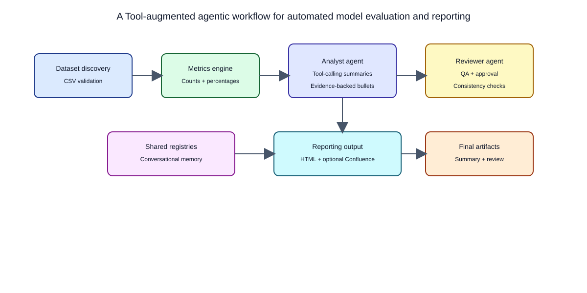

# A Tool-augmented agentic workflow for automated model evaluation and reporting

## Architecture focus

This workflow centers on a dual-agent design: an **Analyst agent** that generates summaries via tool calls and a **Reviewer agent** that validates accuracy and consistency.

## High-Level Components

1. **Input Layer**
   - Dataset CSV files in `OUTPUT_FOLDER`
   - Pattern: `{DATA_SOURCE}_{TYPE}_{FLAG}.csv`

2. **Validation & Metrics Layer**
   - Validates required columns:
     - `score{MODEL_VERSION_NEW}`
     - `score{MODEL_VERSION_OLD}`
   - Computes conviction metrics at threshold `>= 30`

3. **Agentic AI Layer**
   - `langchain-aws` + `ChatBedrockConverse`
   - Tool/function calling to fetch:
     - per-dataset context
     - overall context

4. **Publishing Layer**
   - Confluence-compatible HTML report generation
   - Optional Confluence subpage publish + CSV attachments

## Diagram

