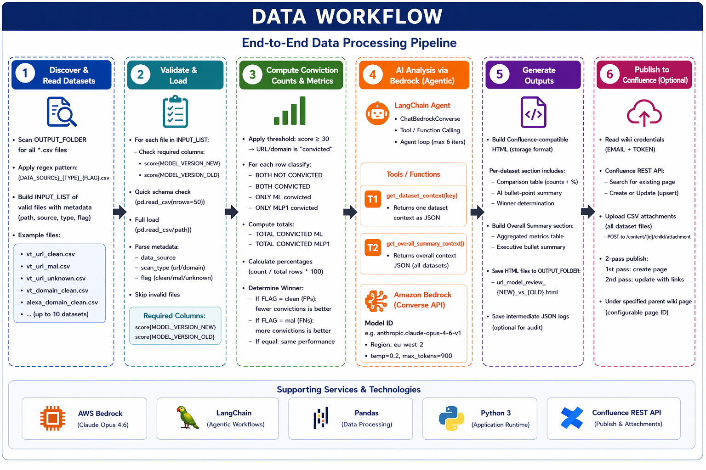

# Dataflow

## End-to-End Pipeline

1. Read `OUTPUT_FOLDER` and build `INPUT_LIST`
2. Parse metadata from filename:
   - `DATA_SOURCE`, `TYPE`, `FLAG`
3. For each dataset:
   - load CSV
   - compute confusion-style conviction counts:
     - BOTH NOT CONVICTED
     - BOTH CONVICTED
     - ONLY ML
     - ONLY MLP1
     - TOTAL CONVICTED ML
     - TOTAL CONVICTED MLP1
   - compute percentages
   - decide winner
   - generate LLM summary (max 4 bullets)
4. Build final report:
   - overall table
   - dataset sections
   - optional Confluence publish

## Diagram

> Copy your uploaded workflow image into `docs/images/data_workflow.png`.
